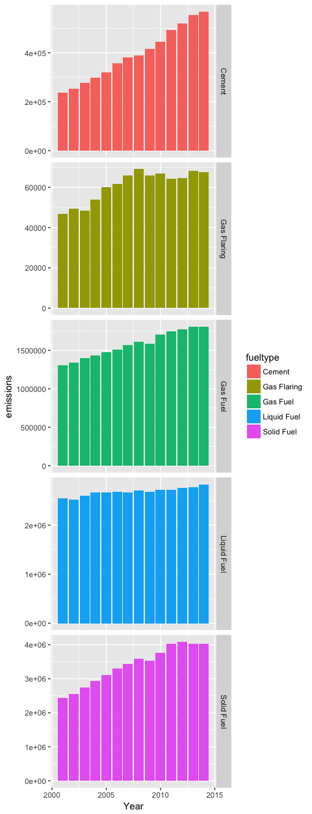

Climate Change Data Exploration Tidyverse
================

Obtaining the Data
==================

We have to specify the column types, as by default readr will believe 'Per Capita' to be an integer when infact it needs to be a double.

``` r
climate<-read_csv("https://pkgstore.datahub.io/core/co2-fossil-by-nation/fossil-fuel-co2-emissions-by-nation_csv/data/0f04181960a0a896ebaf6d8afb0b71a6/fossil-fuel-co2-emissions-by-nation_csv.csv",
                  col_types = cols(
                    Year = col_integer(),
                    Country = col_character(),
                    Total = col_integer(),
                    `Solid Fuel` = col_integer(),
                    `Liquid Fuel` = col_integer(),
                    `Gas Fuel` = col_integer(),
                    Cement = col_integer(),
                    `Gas Flaring` = col_integer(),
                    `Per Capita` = col_double(),
                    `Bunker fuels (Not in Total)` = col_integer())
)
```

Inspecting the top pollutors, per year and all time.
====================================================

Some basic aggregation validates the received wisdom that the US has historically been the biggest contributor to global warming, but that China is now a bigger issue.

``` r
knitr::kable(climate %>% top_n(20, Total) %>% arrange(desc(Total)))
```

|  Year| Country                  |    Total|  Solid Fuel|  Liquid Fuel|  Gas Fuel|  Cement|  Gas Flaring|  Per Capita|  Bunker fuels (Not in Total)|
|-----:|:-------------------------|--------:|-----------:|------------:|---------:|-------:|------------:|-----------:|----------------------------:|
|  2014| CHINA (MAINLAND)         |  2806634|     2026492|       344725|     96504|  338912|            0|        2.05|                        12066|
|  2013| CHINA (MAINLAND)         |  2797384|     2045156|       336960|     87371|  327896|            0|        2.05|                        12057|
|  2012| CHINA (MAINLAND)         |  2734817|     2037338|       321155|     75764|  300560|            0|        2.02|                        12701|
|  2011| CHINA (MAINLAND)         |  2654360|     1995029|       306730|     67137|  285464|            0|        1.97|                        12636|
|  2010| CHINA (MAINLAND)         |  2393248|     1792793|       298191|     54472|  247792|            0|        1.78|                        11687|
|  2009| CHINA (MAINLAND)         |  2181895|     1645333|       268108|     44870|  223584|            0|        1.64|                         9650|
|  2008| CHINA (MAINLAND)         |  2059741|     1563721|       264770|     40850|  190400|            0|        1.53|                         8941|
|  2007| CHINA (MAINLAND)         |  1917316|     1443751|       253098|     35348|  185119|            0|        1.44|                         9154|
|  2006| CHINA (MAINLAND)         |  1780554|     1338803|       245233|     28317|  168201|            0|        1.35|                         8267|
|  2005| CHINA (MAINLAND)         |  1608115|     1207530|       232034|     23187|  145364|            0|        1.23|                         7102|
|  2005| UNITED STATES OF AMERICA |  1578873|      579104|       667143|    317152|   13723|         1751|        5.25|                        41091|
|  2007| UNITED STATES OF AMERICA |  1578683|      575692|       648278|    339433|   13172|         2109|        5.13|                        45630|
|  2004| UNITED STATES OF AMERICA |  1569696|      573935|       662168|    318710|   13466|         1417|        5.26|                        38293|
|  2006| UNITED STATES OF AMERICA |  1553664|      571099|       653101|    313999|   13561|         1903|        5.12|                        42954|
|  2000| UNITED STATES OF AMERICA |  1552682|      564757|       632129|    342282|   12173|         1341|        5.42|                        40072|
|  2003| UNITED STATES OF AMERICA |  1547778|      560926|       648067|    324514|   12829|         1442|        5.24|                        33335|
|  2002| UNITED STATES OF AMERICA |  1538399|      561866|       628411|    334252|   12412|         1458|        5.26|                        37633|
|  2008| UNITED STATES OF AMERICA |  1530982|      566810|       611445|    338359|   11915|         2453|        4.93|                        41815|
|  2001| UNITED STATES OF AMERICA |  1525987|      555810|       634801|    321651|   12301|         1425|        5.27|                        30972|
|  1999| UNITED STATES OF AMERICA |  1501137|      541784|       618335|    327459|   11938|         1621|        5.30|                        38142|

``` r
top10alltime <- climate %>% 
         group_by(Country) %>%
         summarise(total = sum(Total)) %>%
         arrange(desc(total)) %>% 
         top_n(10)
```

    ## Selecting by total

``` r
knitr::kable(top10alltime)
```

| Country                   |      total|
|:--------------------------|----------:|
| UNITED STATES OF AMERICA  |  102510260|
| CHINA (MAINLAND)          |   47649834|
| USSR                      |   30790355|
| UNITED KINGDOM            |   20500813|
| JAPAN                     |   14585037|
| GERMANY                   |   12764185|
| INDIA                     |   11385351|
| RUSSIAN FEDERATION        |   10466421|
| FRANCE (INCLUDING MONACO) |    9697149|
| CANADA                    |    8038299|

``` r
climate %>% 
  filter(Country %in% top10alltime$Country) %>%
  filter(Year>2000) %>%
  ggplot(aes(x=Year, y =Total)) +
    geom_line() +
    theme(legend.position="none") +
    facet_grid(. ~ Country) +
    ggtitle("Total co2 Emissions of Largest 10 Polluters" , subtitle = "2000-2014")
```


Trends in co2 emmissions origin - big picture
=============================================

``` r
climate %>% 
  gather(key=fueltype, Emissions, `Solid Fuel`:`Gas Flaring`) %>% 
  ggplot(aes(x=Year, y=Emissions, color = fueltype)) + geom_bar(stat="identity")
```


Visualising recent changes - total
==================================

``` r
climate %>% 
    filter(Year>2000) %>%
    gather(key=fueltype, Emissions, `Solid Fuel`:`Gas Flaring`) %>% 
    group_by(fueltype, Year) %>%
    summarise(emissions = sum(Emissions)) %>%
    ggplot(aes(x=Year, y=emissions, fill = fueltype)) + geom_bar(stat="identity") + facet_grid(fueltype ~ ., scales = "free_y")
```



Specific Changes by Emission Source of the largest pollutors.
=============================================================

We let the y axis scale per emission source, worth keeping an eye on the overall scale.

``` r
climate %>% 
    filter(Year>2000) %>%
    filter(Country %in% top10alltime$Country) %>%
    gather(key=fueltype, Emissions, `Solid Fuel`:`Gas Flaring`) %>% 
    ggplot(aes(x=Year, y=Emissions, fill = fueltype)) +
        geom_bar(stat="identity") + 
        facet_grid(fueltype ~ Country, scales = "free_y", labeller = label_wrap_gen(10)) +
        theme(legend.position = "none", axis.text.x = element_text(angle = 90))
```


